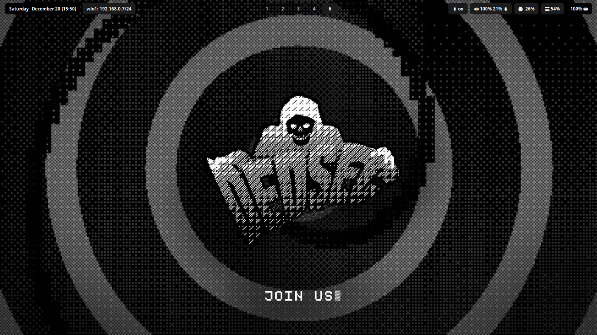

# DOT FILES - Arch x Hyprland

## Aqui terá os arquivos importantes usados para o meu primeiro rice feito

hyprland  
waybar  
kitty  
wofi  
dunst 

É importante que a pasta Wallpapers seja colocada dentro da pasta Imagens da home, ou se preferir, pode alterar o que foi configurado nos seguintes arquivos:  
hypr/hyprland.conf & hypr/scripts/changebg.sh  

### Conforme for aprendendo e melhorando meu rice, incluirei mais files
Talvez esse README e todo o repositório tenham ficado um pouco bagunçados, peço perdão, pois é a primeira vez que faço isso :p

